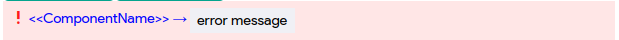

# @xmanscript/has-error-boundary

[](http://commitizen.github.io/cz-cli/)

## Installation Guide

Before we dive into using @xmanscript/has-error-boundary, let's get it set up in your project. You can install it using your preferred package manager. Here's how to do it with npm:

```bash
npm install @xmanscript/has-error-boundary
```

Or, with yarn:

```bash
yarn add @xmanscript/has-error-boundary
```

Now, let's explore how this package can help you handle errors more effectively in your React app!

## Introduction

In any React application, handling errors is crucial. Typically, you'd have one error boundary throughout your app that catches any errors occurring in any part of the app and displays an error message in the UI. However, what if you make a change or add a new feature, and an error occurs in a specific component, causing the entire app to crash? That's a problem we want to solve.

Enter @xmanscript/has-error-boundary. This library allows you to catch errors at the component level, preventing your entire app from crashing. Here's how to use it:

## Usage
1. Create a React custom component, let's call it Test. This component can contain errors you want to catch.

```tsx
import { useState } from "react";

function Test() {
  const [count, setCount] = useState(0);

  return (
    <>
      <div className="card">
        <button onClick={() => setCount((count) => count + 1)}>
          count is {count} {cat}
        </button>
        <p>
          Edit <code>src/App.tsx</code> and save to test HMR
        </p>
      </div>
      <p className="read-the-docs">
        Click on the Vite and React logos to learn more
      </p>
    </>
  );
}

```
In this component, there's an undefined variable cat that we're trying to access in our JSX code.


2. To catch errors within this component, import the Higher-Order Component (HOC) `hasErrorBoundary` from `@xmanscript/has-error-boundary` and wrap your component with it.

```tsx
import { hasErrorBoundary } from "@xmanscript/has-error-boundary";
import { useState } from "react";

function Test() {
  const [count, setCount] = useState(0);

  return (
    <>
      <div className="card">
        <button onClick={() => setCount((count) => count + 1)}>
          count is {count} {c}
        </button>
        <p>
          Edit <code>src/App.tsx</code> and save to test HMR
        </p>
      </div>
      <p className="read-the-docs">
        Click on the Vite and React logos to learn more
      </p>
    </>
  );
}

export default hasErrorBoundary(Test);

```

An additional feature is that you can create a custom error component to display error messages in your own way. To do this, wrap your app with ErrorBoundaryProvider, as shown below:

```tsx
import { ErrorBoundaryProvider } from "@xmanscript/has-error-boundary";
import { App } from "./App"; // Replace with your app import

<ErrorBoundaryProvider
  errorComponent={(params) => {
    return (
      <div>
        <p>{params?.errorLocation}</p>
        <p>{params?.fileName}</p>
        <p>{params?.errorMessage}</p>
      </div>
    );
  }}
>
  <App/>
</ErrorBoundaryProvider>

```

The errorComponent provided will be rendered whenever there is an error in your components wrapped by hasErrorBoundary.


The default error component looks like this:


 Note: For `typescript` projects if you want to type the return type of `hasErrorBoundary`, it is typed as `GoodComponent`.

Happy Coding 🚀.
